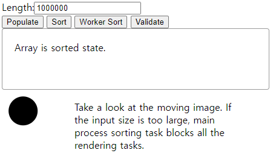

# web-worker-example
This repository is an example project to test
[Web Worker](https://developer.mozilla.org/en-US/docs/Web/API/Web_Workers_API/Using_web_workers).

## How to Run
Simply upload the whole repository on the local web server
and open `sort.html`. I recommend `python -m http.server`
if you have Python installed.